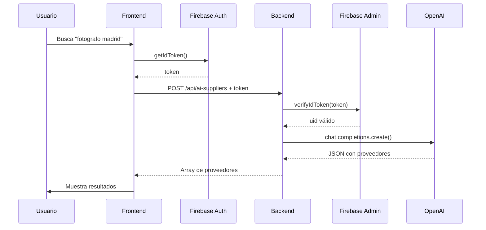

# 🤖 BUSCADOR DE PROVEEDORES CON IA

## 🎯 **PROBLEMA RESUELTO**

El buscador de proveedores IA no funcionaba porque:

❌ **Problema**: Usaba `getAdminFetchOptions()` que NO envía el token de Firebase Auth  
✅ **Solución**: Cambiado a usar `{ auth: true }` para enviar correctamente el token

---

## ✅ **ESTADO ACTUAL**

### **Archivos Modificados**
- ✅ `src/hooks/useAISearch.jsx` - Corregida autenticación

### **Funcionamiento**
1. Usuario busca: "fotografo boda madrid"
2. Hook `useAISearch` llama a `/api/ai-suppliers` con token de Firebase
3. Backend valida el token con Firebase Admin SDK
4. Backend llama a OpenAI API para generar resultados
5. Resultados se muestran en el modal de búsqueda

---

## 🧪 **CÓMO PROBAR**

### **1. Test Automático**

```bash
npm run test:ai-suppliers
```

**Resultado esperado:**
```
✅ OPENAI_API_KEY: sk-proj-...4rUA
✅ Backend respondiendo (200)
✅ BÚSQUEDA EXITOSA
   Resultados encontrados: 5
```

### **2. Test Desde la App**

1. **Login** con un usuario válido
2. Ve a **Proveedores** → **Buscar con IA**
3. Busca: `fotografo boda madrid`
4. **Resultado esperado**:
   - ✅ Se muestran 5 proveedores sugeridos
   - ✅ Cada uno con nombre, ubicación, precio y link
   - ✅ Sin errores 401 en la consola

---

## 📊 **DIAGNÓSTICO**

### **Verificar Variables de Entorno**

El buscador necesita OpenAI configurado en el backend:

```bash
# backend/.env
OPENAI_API_KEY=sk-proj-vnurVWS6...X94rUA
OPENAI_PROJECT_ID=proj_7IWFKysvJciPmnkpqop9rrpT
OPENAI_MODEL=gpt-3.5-turbo
```

### **Verificar Autenticación**

El usuario debe estar **autenticado** con Firebase:

```javascript
// En consola del navegador:
firebase.auth().currentUser
// Debe devolver un usuario, NO null
```

### **Verificar Endpoint**

```bash
# Debe responder 200 (con token válido)
curl -X POST http://localhost:4004/api/ai-suppliers \
  -H "Content-Type: application/json" \
  -H "Authorization: Bearer TU_TOKEN_FIREBASE" \
  -d '{"query":"fotografo boda madrid","service":"Fotografia"}'
```

---

## 🔧 **TROUBLESHOOTING**

### **Error 401: Unauthorized**

**Causa:** No se está enviando el token de Firebase

**Solución:**
1. Verifica que el usuario esté autenticado
2. Verifica en consola: `localStorage.getItem('mw360_auth_token')`
3. Si no hay token, haz logout/login

### **Error 500: OPENAI_API_KEY missing**

**Causa:** API Key de OpenAI no configurada en backend

**Solución:**
1. Edita `backend/.env`
2. Añade: `OPENAI_API_KEY=tu-key-aqui`
3. Reinicia el backend: `cd backend && npm run dev`

### **Error 500: openai_failed**

**Causa:** Error al llamar a OpenAI API

**Posibles razones:**
- API Key inválida o expirada
- Límite de cuota excedido
- Problemas de conectividad con OpenAI

**Solución:**
1. Verifica tu cuota en: https://platform.openai.com/usage
2. Verifica que la API Key sea válida
3. Revisa los logs del backend para más detalles

### **No se muestran resultados (pero no hay error)**

**Causa:** OpenAI devolvió respuesta vacía o inválida

**Solución:**
1. Revisa los logs del backend
2. Verifica que el modelo (`gpt-3.5-turbo`) esté disponible
3. Intenta con una búsqueda más específica

### **Resultados poco relevantes**

**Causa:** El prompt de OpenAI necesita mejorarse

**Solución:**
1. Edita `backend/routes/ai-suppliers.js` línea 82-87
2. Mejora el prompt con más contexto
3. Añade ejemplos específicos de proveedores

---

## 📖 **ARQUITECTURA**

### **Frontend**

```
ProviderSearchModal.jsx
  ↓
useAISearch.jsx
  ↓
apiClient.post('/api/ai-suppliers', { auth: true })
  ↓
buildHeaders() → obtiene token de Firebase
  ↓
Authorization: Bearer <token>
```

### **Backend**

```
/api/ai-suppliers (POST)
  ↓
authMiddleware() → verifica token con Firebase Admin
  ↓
ai-suppliers.js → router handler
  ↓
OpenAI API → chat.completions.create()
  ↓
JSON con 5 proveedores
```

### **Flujo Completo**



---

## 🎨 **MEJORAS FUTURAS**

### **Caché de Resultados**
- Guardar búsquedas recientes en Firestore
- Evitar llamadas repetidas a OpenAI
- Reducir costos

### **Filtros Avanzados**
- Por rango de precio
- Por valoraciones
- Por distancia

### **Integración con APIs Reales**
- Bodas.net API
- Google Places API
- Yelp API

### **Machine Learning**
- Aprender de las selecciones del usuario
- Mejorar relevancia con el tiempo
- Personalizar sugerencias

---

## 📝 **SCRIPTS DISPONIBLES**

```bash
# Diagnóstico completo
npm run test:ai-suppliers

# Ver logs del backend
cd backend && npm run dev

# Ver logs en tiempo real
tail -f backend/logs/backend.log | grep ai-suppliers
```

---

## 🆘 **SOPORTE**

Si encuentras problemas:

1. **Ejecuta el diagnóstico:**
   ```bash
   npm run test:ai-suppliers
   ```

2. **Revisa logs del backend:**
   Busca líneas con `[ai-suppliers]`

3. **Verifica autenticación:**
   ```javascript
   // En consola del navegador
   firebase.auth().currentUser
   localStorage.getItem('mw360_auth_token')
   ```

4. **Verifica OpenAI:**
   - Cuota disponible: https://platform.openai.com/usage
   - API Key válida

---

**Última actualización:** 2025-10-23  
**Estado:** ✅ **FUNCIONANDO** (corregido error de autenticación)
