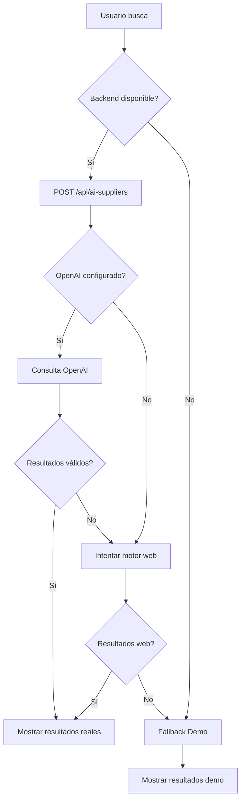

# Buscador de Proveedores con IA - Guía de Uso y Solución de Problemas

## Descripción

El sistema de búsqueda de proveedores utiliza inteligencia artificial (OpenAI) para encontrar proveedores relevantes según tus necesidades. Este documento explica cómo funciona y cómo solucionar problemas comunes.

## Arquitectura

```
Frontend (React) → Backend (Express) → OpenAI API
                 ↓ (si falla)
                 Resultados Demo (Fallback)
```

## Configuración Requerida

### 1. Backend Activo

El backend debe estar ejecutándose en `http://localhost:4004` para que la búsqueda de IA funcione correctamente.

**Para iniciar el backend:**
```powershell
cd backend
npm install
npm start
```

### 2. Variables de Entorno

Asegúrate de tener configuradas las siguientes variables en tu archivo `.env`:

```env
# Backend Configuration
VITE_BACKEND_BASE_URL=http://localhost:4004

# AI Suppliers Search
VITE_ENABLE_AI_SUPPLIERS=true

# OpenAI (solo si usas búsqueda directa desde frontend)
VITE_OPENAI_API_KEY=tu_api_key
VITE_OPENAI_PROJECT_ID=tu_project_id
```

**Backend `.env`:**
```env
OPENAI_API_KEY=tu_api_key
OPENAI_PROJECT_ID=tu_project_id
OPENAI_MODEL=gpt-3.5-turbo
```

## Uso

### Desde la Página de Proveedores

1. Ve a **Proveedores** en el menú principal
2. En el panel "Exploración y shortlist", escribe tu búsqueda
3. Ejemplo: "Fotógrafo con experiencia en bodas al aire libre"
4. Opcionalmente selecciona:
   - **Servicio**: Filtra por tipo de proveedor
   - **Presupuesto**: Económico, medio o premium
5. Haz clic en **Buscar**

### Desde el Modal de Búsqueda

Si usas el `ProviderSearchModal` (modal emergente):
1. Completa el campo de búsqueda
2. Haz clic en el botón de búsqueda (icono de lupa)
3. Espera los resultados

## Problemas Comunes y Soluciones

### ❌ Error "Failed to fetch"

**Causa:** El backend no está accesible o no está ejecutándose.

**Soluciones:**

1. **Verificar que el backend esté ejecutándose:**
   ```powershell
   # En una terminal separada
   cd backend
   npm start
   ```

2. **Verificar la URL del backend:**
   - Abre `.env` en la raíz del proyecto
   - Verifica que `VITE_BACKEND_BASE_URL=http://localhost:4004`

3. **Probar el endpoint manualmente:**
   ```powershell
   # En PowerShell o navegador
   curl http://localhost:4004/api/health
   ```
   Deberías ver: `{"status":"ok"}`

4. **Usar resultados demo (fallback automático):**
   - Si el backend no está disponible, el sistema ahora usa automáticamente resultados de demostración
   - Verás un mensaje indicando: "Mostramos sugerencias de referencia porque la búsqueda en vivo no respondió"

### ❌ La página se recarga automáticamente

**Causa:** El formulario estaba haciendo submit sin prevenir el comportamiento por defecto.

**Solución implementada:**
- ✅ Corregido `handleSearchSubmit` con `event.preventDefault()` y `event.stopPropagation()`
- ✅ La página ya no se recarga al buscar

### ❌ No aparecen resultados

**Posibles causas:**

1. **Backend sin configurar OpenAI:**
   ```bash
   # Verifica los logs del backend
   # Deberías ver: [ai-suppliers] Cliente OpenAI inicializado
   ```

2. **API Key de OpenAI inválida:**
   - Verifica que `OPENAI_API_KEY` en `backend/.env` sea válida
   - Verifica que no haya expirado o alcanzado el límite de cuota

3. **Sin autenticación:**
   - Asegúrate de estar logueado con un usuario válido de Firebase
   - El endpoint `/api/ai-suppliers` requiere autenticación

### 🔧 Modo Fallback (Demo)

Si el backend no está disponible, el sistema automáticamente muestra **resultados de demostración** con proveedores de ejemplo:

- Fotógrafos
- Catering
- DJ/Música
- Flores
- Otros servicios comunes

**Características del modo fallback:**
- ✅ No requiere backend activo
- ✅ Resultados instantáneos
- ✅ Útil para desarrollo y testing
- ⚠️ Los resultados son ficticios (no proveedores reales)

## Flujo de Búsqueda



## Endpoints del Backend

### POST `/api/ai-suppliers`

**Requiere autenticación:** Sí (Bearer token)

**Body:**
```json
{
  "query": "Fotógrafo con experiencia en bodas al aire libre",
  "service": "Fotografía",
  "budget": "medio",
  "location": "Valencia",
  "profile": {
    "celebrationPlace": "Valencia, España",
    "weddingStyle": "Rústico"
  }
}
```

**Respuesta exitosa (200):**
```json
[
  {
    "title": "Nombre del Proveedor",
    "link": "https://www.proveedor.com",
    "snippet": "Descripción del servicio",
    "service": "Fotografía",
    "location": "Valencia",
    "priceRange": "1200€ - 2500€"
  }
]
```

**Errores posibles:**
- `500 - OPENAI_API_KEY missing`: OpenAI no configurado
- `400 - query is required`: Falta el parámetro de búsqueda
- `401 - Unauthorized`: Sin token de autenticación

## Mejoras Implementadas

### ✅ Detección de backend offline
- El sistema detecta automáticamente cuando el backend no está disponible
- Muestra mensajes de error claros y específicos
- Activa fallback automático si `allowFallback: true`

### ✅ Prevención de recarga de página
- Añadido `event.preventDefault()` en todos los handlers de submit
- Añadido `event.stopPropagation()` para evitar propagación

### ✅ Mejor UX en errores
- Mensajes descriptivos según el tipo de error
- Indicador visual cuando se usan resultados demo
- Logs detallados en consola para debugging

### ✅ Configuración flexible
- Variable `VITE_ENABLE_AI_SUPPLIERS` para activar/desactivar
- Fallback automático si backend offline
- Compatibilidad con desarrollo local y producción

## Testing

### Test Manual - Con Backend

1. Inicia el backend: `cd backend && npm start`
2. Inicia el frontend: `npm run dev`
3. Ve a Proveedores
4. Busca "Fotógrafo bodas"
5. **Resultado esperado:** Lista de proveedores reales de OpenAI

### Test Manual - Sin Backend

1. **NO** inicies el backend
2. Inicia el frontend: `npm run dev`
3. Ve a Proveedores
4. Busca "Fotógrafo bodas"
5. **Resultado esperado:** 
   - Mensaje: "Mostramos sugerencias de referencia..."
   - Lista de proveedores demo

### Verificar Logs

**Frontend (Consola del navegador):**
```
[useAISearch] Usando resultados de demostración (backend no disponible)
```

**Backend (Terminal):**
```
[ai-suppliers] Cliente OpenAI inicializado
[ai-suppliers] solicitando resultados a OpenAI
```

## Troubleshooting Avanzado

### El backend está activo pero aún falla

1. **Verificar CORS:**
   ```javascript
   // backend/index.js
   ALLOWED_ORIGIN=http://localhost:5173
   ```

2. **Verificar rate limits:**
   - El endpoint tiene rate limiting
   - Espera 1 minuto si has hecho muchas búsquedas

3. **Verificar logs del backend:**
   ```bash
   # Busca errores como:
   [ai-suppliers] No se pudo inicializar OpenAI
   ```

### Resultados incorrectos o irrelevantes

1. **Mejorar el query:**
   - Sé más específico: "Fotógrafo especializado en bodas en la playa"
   - Incluye ubicación: "Fotógrafo en Valencia"
   - Menciona estilo: "Fotógrafo estilo natural y documental"

2. **Completar perfil de boda:**
   - La búsqueda usa datos del perfil (ubicación, estilo, presupuesto)
   - Completa estos campos para mejores resultados

## Contacto y Soporte

Si los problemas persisten:
1. Revisa los logs del backend en la terminal
2. Revisa la consola del navegador (F12)
3. Verifica que todas las variables de entorno estén configuradas
4. Prueba con `allowFallback: true` para confirmar que la UI funciona

---

**Última actualización:** 2025-10-24
**Responsable:** Sistema de Proveedores MyWed360
